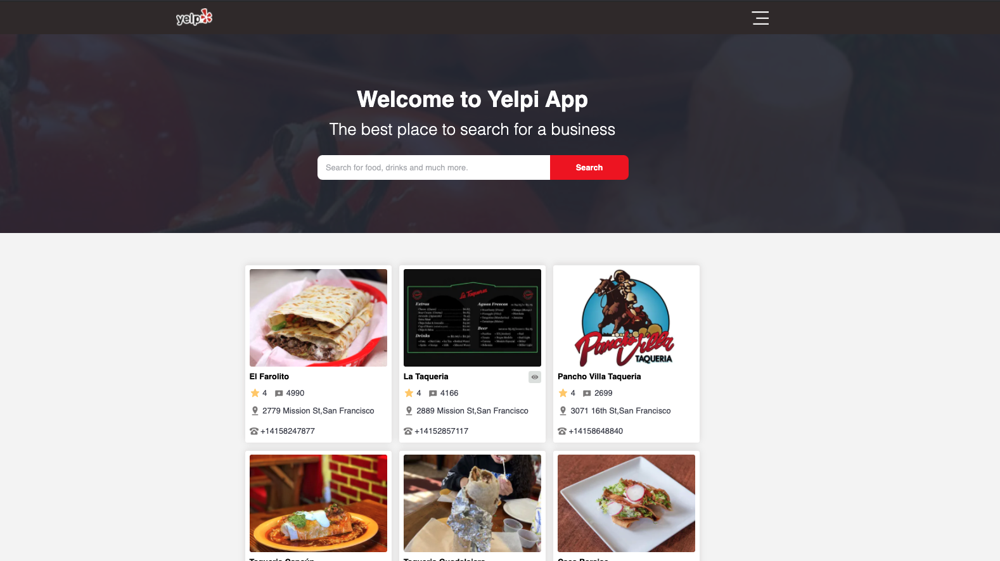

<!-- PROJECT LOGO -->
<br />
<p align="center">
  <a href="https://github.com/juank1791/yelp-app">
    
  </a>

  <h3 align="center">YELP PP</h3>

  <p align="center">
    React application consuming Yelp Graphql API
    <br />
    <a href="https://github.com/juank1791/yelp-app"><strong>Explore the docs »</strong></a>
    <br />
    <a href="https://yelpapp.vercel.app/">View Demo</a>
  </p>
</p>

<!-- TABLE OF CONTENTS -->
<details open="open">
  <summary><h2 style="display: inline-block">Table of Contents</h2></summary>
  <ol>
    <li>
      <a href="#about-the-project">About The Project</a>
      <ul>
        <li><a href="#built-with">Built With</a></li>
      </ul>
    </li>
    <li>
      <a href="#getting-started">Getting Started</a>
      <ul>
        <li><a href="#prerequisites">Prerequisites</a></li>
        <li><a href="#installation">Installation</a></li>
      </ul>
    </li>
    <li><a href="#usage">Usage</a></li>
    <li><a href="#license">License</a></li>
    <li><a href="#contact">Contact</a></li>
    <li><a href="#acknowledgements">Acknowledgements</a></li>
  </ol>
</details>

<!-- ABOUT THE PROJECT -->

## About The Project



### Built With

- Typescsript
- Nextjs
- Redux toolkit
- Apollo Client
- SASS for Styling
- [Figma for the UI](https://www.figma.com/file/BuEYDB27UpPEvsPPBOy9ay/Yelp-app?node-id=0%3A1)

<!-- GETTING STARTED -->

## Getting Started

To get a local copy up and running follow these simple steps.

### Prerequisites

This is an example of how to list things you need to use the software and how to install them.

- yarn
  ```sh
  npm install --global yarn
  ```

### Installation

1. Clone the repo
   ```sh
   git clone https://github.com/juank1791/yelp-app
   ```
2. Install NPM packages
   ```sh
   yarn install
   # or npm install
   ```
3. Run server
   ```sh
   yarn dev
   # or npm start
   ```
   <!-- USAGE EXAMPLES -->

## Usage

- Enter a term to search like pizza, burrito, tacos and will search in the Yelp API businesses within that categories.
- You can click a item once they appear and see their details.
- When you hit back button, you can view the last results of your search and the business item with 👁️ icon to make sure you already viewed that business info.
<!-- LICENSE -->

## License

Distributed under the MIT License. See `LICENSE` for more information.

<!-- CONTACT -->

## Contact

Juan Carlos cruz - juancarloscruz278@gmail.com

Linkedin: [https://www.linkedin.com/in/juancarlos-cruz/](https://www.linkedin.com/in/juancarlos-cruz/)

Project Link: [https://yelpapp.vercel.app/](https://yelpapp.vercel.app/)

<!-- ACKNOWLEDGEMENTS -->

## Acknowledgements

- [Yelp Graphql API](https://www.yelp.com/developers/graphql/guides/intro)
- [Nextjs](https://nextjs.org/)
- [Apollo Client Docs](https://www.apollographql.com/docs/)
- [Redux Toolkit](https://redux-toolkit.js.org/)
